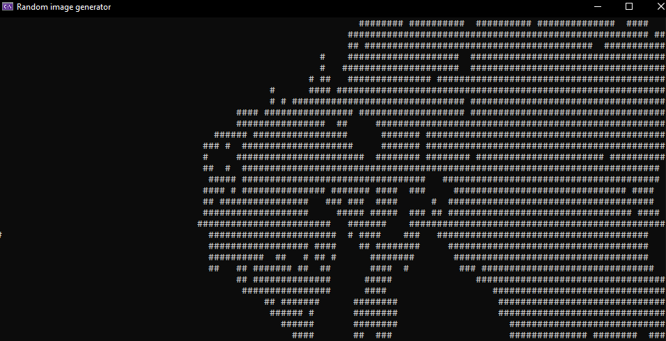

# Random Image Generator (RIG)

RIG is a byproduct from my [previous project](https://github.com/HardcoreMagazine/Enlashceoc), 
discovered by accident during creation of maze generation algorithm.  
RIG allows you to create random abstract images, just like this one:
  
*Please note that this algorithm is highly unstable and it may take a while until you get clear 
picture instead of random mess.*

---
## Features:
+ Image creation
+ Image saving on local hard drive
+ Image color inversion
+ Image rotation (180 degrees)

---
## Download
+ [.NET 6 dependant version / win x64 only](https://github.com/HardcoreMagazine/RandomImageGenerator/releases/download/v1.0/RandomImageGenerator.zip)

---
## License
+ [MIT LICENSE](LICENSE.txt)  

---
### Have fun!